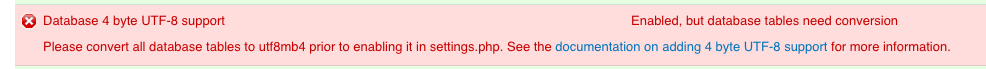

**Recommendations on File structure**:

* Identify if this a Page 1/4 potential scenario

* Change the file name from `install-migration.md` to `migration.md` or `migrate.md`
* File names should contain the topic i.e. migration or migrate not "install"
* Order the files in the `migrate` directory. 
  * Unclear what order and not everyone comes from the "pretty"docs URL. 
  * Endusers might review docs in the Github.com repo (online / browser) or within a cloned ISLE project (IDE or cli)

```bash
├── migrate
│   ├── export-checklist.md
│   ├── install-migration.md
│   ├── merge-checklist.md
│   └── reindex-process.md
```

becomes

```bash
├── migrate
│   ├── migrate-01.md
│   ├── migrate-export-checklist-02.md
│   ├── migrate-merge-checklist-03.md
│   └── migrate-reindex-04.md
```

### Ideal Outline of this document

This document will guide an end-user:

* Fork the current ISLE project
* Create the git upstreams outlined in the [REMOTE Server ISLE Installation](https://islandora-collaboration-group.github.io/ISLE/install/install-server/)
* Edit and commit the ISLE configurations to setup a `Staging` environment in git
* Clone this setup to the ISLE Host server
* Create a temporary data storage directory
  * Review and follow the [Migration Export Checklist](https://islandora-collaboration-group.github.io/ISLE/migrate/export-checklist/) for data locations, user names etc to determine what production data needs to be copied over.
  * Copy the current production data to the temporary data storage directory on the ISLE host server
* Review and follow the [Migration Merge Checklist](https://islandora-collaboration-group.github.io/ISLE/migrate/merge-checklist/) for configuration files locations etc to determine what production configuration files need to be copied over.
  * Create a temporary configuration storage directory on your local workstation
  * Copy over the appropriate production configuration files to be edited and merged
  * Review and follow the [Migration Merge Checklist](https://islandora-collaboration-group.github.io/ISLE/migrate/merge-checklist/) for the list of files to edit and merge. 
    * Solr files - Diff process for your potentially customized files and ISLE's stock. 
      * How to bind mount this file for customization
    * Gsearch transforms
      * `foxmltoSolr.xslt` Diff process for your potentially customized file and ISLE's stock. 
        * How to bind mount this file for customization
      * Additional files in the `islandora_transforms` directory - Diff process for your potentially customized file and ISLE's stock. 
        * How to bind mount this file for customization
  * Upon finishing merge process, git commit process to ISLE project directory
* Clone / git pull new changes to current ISLE project directory on `Staging` Server
* Move production data directories to locations that match the ISLE environment docker-compose.yml volume paths and definitions. 
* docker-compose up -d all containers
* Run `fix-permission.sh` script on Apache container
* Import the Production MySQL database
* Use drush to change the admin password
* Use drush st to check basic connectivity between Drupal site and MySQL database
* Check basic connectivity of site
* Run Fedora reindex process
* Run Solr reindex process
* QC site

* Repeat entire process for `Production` environment
  * Identify steps that can be fast tracked or not repeated.

---

# Migrate to ISLE Environment

_Expectations:  It may take at least **8 hours or more** to read this documentation and complete this installation. Please proceed slowly._

This guide will help you migrate your existing production Islandora 7.x environment to an ISLE environment (`Staging`) and/or (`Production`) or both.

This guide will also help you identify and copy your institution's preexisting Islandora data, files, and themes (including your data volume, Drupal site(s) and theme(s), and commonly customized xml and xslt files) to your ISLE environment using two key checklists:

* [Migration Export Checklist](https://islandora-collaboration-group.github.io/ISLE/migrate/export-checklist/) for data locations, user names etc. 

* [Migration Merge Checklist](https://islandora-collaboration-group.github.io/ISLE/migrate/merge-checklist/) for how to edit and merge in customizations from your current non-ISLE system to ISLE.

Please post questions to the public [Islandora ISLE Google group](https://groups.google.com/forum/#!forum/islandora-isle), or subscribe to receive emails. The [Glossary](../appendices/glossary.md) defines terms used in this documentation.

---

## Assumptions / Prerequisites

* Enough disk space on - or mounted to - the host server large enough to store a **full copy** of your fedora data store.
  * Please refer to the [Migration Export Checklist](https://islandora-collaboration-group.github.io/ISLE/migrate/export-checklist/) for data locations and methods to determine file sizes etc.

* You have sufficient storage available for the ISLE host server to accommodate a working copy of a production Islandora's associated configurations and data.
  * Please refer to the [Migration Export Checklist](https://islandora-collaboration-group.github.io/ISLE/migrate/export-checklist/) for data locations and methods to determine file sizes etc.

* You have already completed:
  * the ISLE Host Server [Hardware Requirements](../install/host-hardware-requirements.md)
  * the ISLE Host Server [Software Dependencies](../install/host-software-dependencies.md)
  * the [ISLE Configuration Setup](../install/install-server.md).
    * You will have edited the involved files to fit the environment you are setting up e.g. `Staging` or `Production`
    * This newly edited setup will have been cloned to the ISLE Host Server that you want to migrate to preferably starting with `Staging` and then repeating this edit process for `Production`

* **Please note:** It is strongly recommended that:
  
  * During this migration process you create new passwords for most if not all of your users and services. This is to ensure the following, good security and ensuring that your new system isn't attempting to connect to your old but still running Production system. This process will guarantee a standalone unique ISLE system.
  * Build your `Staging` ISLE system first
  * Build your `Production` ISLE system next, having learned what changes to make from the previous `Staging` ISLE configuration / environment build process

* **Warning - Never ever share or post your .env files publicly.** The .env and tomcat.env files ("Docker Environment files") are your primary resources for customizing your ISLE stack. These .env files contain passwords and usernames and must be treated with the utmost care.

Instructions from this guide and it's associated checklists may call for you to **COPY** data from your current production server and / or appropriate Islandora environment to your ISLE Host Server or local computer. You work from this copied data to build your ISLE environment. In some cases, you'll need to copy configurations down to your local computer (`Local ISLE config laptop`) and edit or merge contents as directed. In other cases, due to the size of the data e.g. Fedora data you will copy directly to the ISLE Host server (`Remote ISLE Host server`). You will note where you have stored copies of files/data in a docker-compose.yml file. You will store your configured files in a git repository and use that to deploy to the ISLE host server.

### Create Data Storage Directory

This area will be where all current Islandora production data is to be stored. This includes the Apache `/var/www/html` directory and the appropriate Fedora `/usr/local/fedora/data` subdirectories outlined below.

**ON your ISLE Host server:**

* Create a directory named `yourdomain-data` (where "yourdomain" is your server domain name)

    * Example:  `project-name.yourdomain.edu-data`

* Ensure that the islandora user has ownership and permissions to access this data.

    * `chown -Rv islandora:islandora ~/project-name.yourdomain.edu-data`

    * Please note this path may change depending on how your ISLE host server storage area is setup.

---

### Migration Export Checklist

**WARNING** - This section seems to have fragments of instructions that are not refered to anywhere in the documentation. Cleanup required here.

* In the `/opt/ISLE/yourdoman-config` directory create a new sub-directory (you can call this `current_prod_islandora_config`)

* You will copy some files from your current Islandora Production server(s) into this directory following the [Migration Export Checklist](../migrate/export-checklist.md) and you will copy some files and folders directly to your ISLE host server (in case the data involved is too large for your local workstation) as directed in the checklist.

    * **Noting** most likely the Apache data (`/var/www/html`) & Fedora data (`/usr/local/fedora/data`) will be moved directly to your ISLE host server storage area and your new ISLE config files will be built on your local machine in the `current_prod_islandora_config` folder you just created.

* These copied files will be the source for edits and merges - just to be very clear, please **don't work directly on these files in your currently running production Islandora system!**

* To be even more clear, after following the checklist, you should now have two nearly identical `/config` subdirectories
    * **A.** copied from the cloned ISLE repository and renamed with your domain e.g. `yourdomain-config or project-name.yourdomain.edu-config`
    * **B.** copied from your currently running Islandora environment. e.g. `current_prod_islandora_config`

### Migration Merge Checklist

The **goal** is to merge all site-specific data (domain names, variables, usernames, passwords, etc..) AND all site-specific customizations or settings from the files in directory B. into the matching files in directory A.

* Compare the data and settings of the files found within directory **B.** `current_prod_islandora_config`, and then merge, edit or copy as necessary with the templated settings found within the renamed directory **A.** `yourdomain-config` as guided in the [Migration Merge Checklist](../migrate/merge-checklist.md).

* Customizations: (_optional_) Carefully compare the following most frequently customized files with the new, default versions found within your new ISLE config folder. Use a "Diff" tool (example: [Beyond Compare](https://www.scootersoftware.com/download.php) to merge any desired customizations from your production Islandora files to persist within the new ISLE config folder of files:

   * Compare and merge the Solr files: `schema.xml`
   * Compare and merge the Solr files: `solrconfig.xml`
   * Compare and merge the Solr files: `stopwords`
   * Compare and merge the Fedora GSearch Islandora Transform (XSLTs) folder of files: `islandora_transforms`


---

## Final Steps

* Now that all the changes are made (be sure to save), ISLE should be ready to test. First you'll need to push these changes to your private code repository.

    * Open a terminal - `cd` to the config directory you've been making the changes in...

    * `git status`  this will show you all the files that have been modified and ready to be added to your private repository along with handy paths for the next steps.

    * `git add /pathtoyourmodifiedfile` (replace "pathtoyourmodifiedfile" with the path to your config directory)

    * run these:

    `git add apache`
    `git add fedora`
    `git add mysql`
    `git add proxy`
    `git add solr`
    `git add docker-compose.yml`

    * run `git status` again - everything should be in green now as all modified files have been added - if anything's still red use git add and the path to add it

    * then run `git commit -m "initial config commit"` inside the double quotes is the commit message you can say whatever you want in this message - so for example if this is the config for your dev instance you could say that...

    * run `git push origin master` this will push all your changes to the repository further changes should be made on branches for different servers or to master branch for this same server


---

##Clone Custom Configuration to Host Server

* Open a terminal - ssh into your host server using the `islandora` user

* `cd` to `/opt/ISLE/config/`

* because your customizations are in a **private** repository, you'll need to add this islandora user's `id_rsa.pub` key to the repository via the website.

* This key is found in `/home/islandora/.ssh/id_rsa.pub`

* One can simply run `cat /home/islandora/.ssh/id_rsa.pub` and copy the output (ensure no whitespaces or extra returns)

* Go to the repository web site with a browser and locate your private repository.

      * locate the ssh key entry location (in Bitbucket this is in Settings / Access Keys /
      * **add** an ssh key w/ the label **islandora host server** paste in the key text and click **Add Key**

* Back at your terminal command line, run `git clone URLpathtoyourremoteprivaterepo.git .` (replacing "URLpathtoyourremoteprivaterepo" with the URL to the repository provided by the website)

* `cd` into the newly cloned directory - this is a good time to check that the ISLE directory contains your `yourdomain-config` directory and that it reflects all the edits and customizations.

## Spin up ISLE Containers

### Review or Pull Down ISLE Docker Images

_Please Note: You may have already done this in setting up the host server manually and / or with Ansible. However it is always a good idea to review and check using the first command below._

* Check if all ISLE images have been downloaded
  * `docker image ls`

  * If yes, then proceed to Step 7

  * If not, then pull the latest images:
    * `docker-compose pull`

---

### Spin Up the Proxy Container
=======


* `cd /opt/ISLE/yourdomain-config`
* `docker-compose up -d proxy`


### Spin up the MySQL Container and Import Production Database(s)

* `cd /opt/ISLE/yourdomain-config`
* `docker-compose up -d mysql`

Two methods for connecting to the MySQL Database (GUI / CLI) pick one.

1. One may use SQL GUI clients e.g. Sequel Pro, Navicat, PHPMyAdmin etc. and import the production Drupal website database(s)

2. If the above not practical, one may connect to the MySQL container and run the following.

    * `docker exec -it isle-mysql-institution bash` to connect to the container
        * swap out `institution` for the correct container name.
    * appropriate mysql commands here: consult MySQL documentation - https://dev.mysql.com/doc/refman/5.7/en/

2a. (_optional_) Only follow this if you have **not** first run `drush cc all` and then exported the MySQL databases or if you have **not** exported the MySQL databases excluding the contents of any table with `cache` in the name.

The following are STEPS, not literal commands to prepare your db for ISLE (_doing this because we've found there are errors using exported db from production because of caches - causes problems - steps below help you remove this problem_)

* import the production databases into the isle-mysql-institution container (_with errors being ignored_)
* truncate all tables that start with `cache` on the isle-mysql-institution container
* export this new database to the `mysql` directory on the isle host server
* delete all tables (_not the database itself_) on the isle-mysql-institution container
* Re-import the new lighter database to the isle-mysql container

---

### Spin up the Fedora Container and Start the Reindex Processes

Staying within `/opt/ISLE/yourdomain-config`
* `docker-compose up -d fedora`
    * _optional_ check if fedora is running properly e.g. `http://isle-prod-project.institution:8080/manager/html`
* `docker exec -it isle-fedora-institution bash`

* Follow the steps outlined in the [Migration Reindex Process Guide](../migrate/reindex-process.md)
    * Follow the steps outlined in the Reindex Fedora RI (1 of 3) section
    * Follow the steps outlined in the Reindex SQL database (2 of 3) section
    * Pause here before attempting the steps within the Reindex Solr (3 of 3) section.
    * Move onto the next section in this guide, `Spin up apache container`.

---

### Spin up Apache Container

* Staying within `/opt/ISLE/yourdomain-config`

* `docker-compose up -d apache`

* `docker exec -it isle-apache-institution bash`

*  Run the vset script
    * `cd /var/www/html`
    * `./vsets.sh`  

* Edit .htaccess to enforce https
    * `echo "SetEnvIf X-Forwarded-Proto https HTTPS=on" | tee -a /var/www/html/.htaccess`

* Check if the site is now is running properly by opening a web browser and navigating to your new ISLE domain e.g. `https://isle-prod-project.institution`

* Please note while you may be able to see objects being displayed, metadata and search results will be empty until you run the last step in the Reindex process.

**Troubleshooting Note** Sites migrating *from* a version of Drupal prior to 7.50 may need to update their mysql tables to utf8mb4.  On the new site, go to `https://isle-prod-project.institution/admin/reports/status` (you will need to be logged in as a Drupal Admin) and look for the following error:



Instructions for converting the Drupal mysql database are available on the [Drupal website](https://www.drupal.org/project/utf8mb4_convert)

---

### Spin Up Solr Container and Complete the Reindex Processes
=======

* Staying within `/opt/ISLE/yourdomain-config`
* `docker-compose up -d solr`
  * (_optional_) check if solr is running properly e.g. `http://isle-prod-project.institution:8777/manager/html`

* `docker exec -it isle-fedora-institution bash` **NOTE FEDORA NOT SOLR!**

* Follow the steps outlined in the [Migration Reindex Process Guide](../migrate/reindex-process.md)
    * Follow the steps outlined only in the Reindex Solr (3 of 3) section.
       * (_Ensure that Tomcat and Fedora are running._)

* Check the results on the site using Islandora simple search or the appropriate search method.

Congratulations you should have successfully migrated your production Islandora site to ISLE!!
